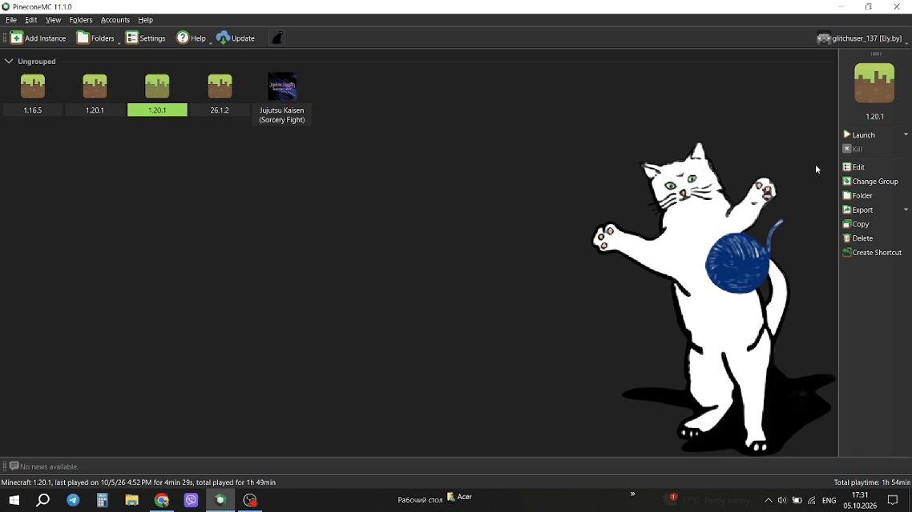
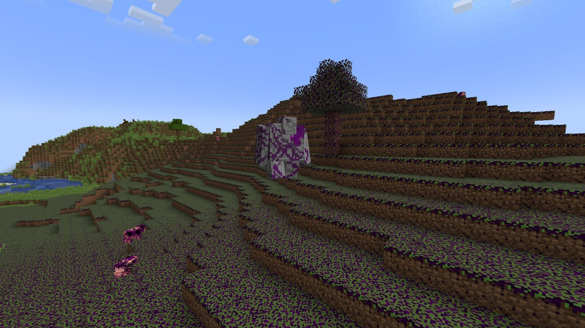
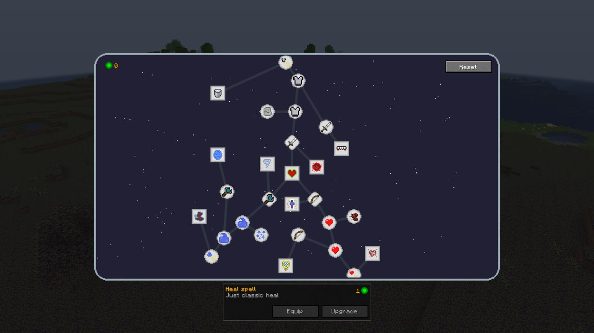
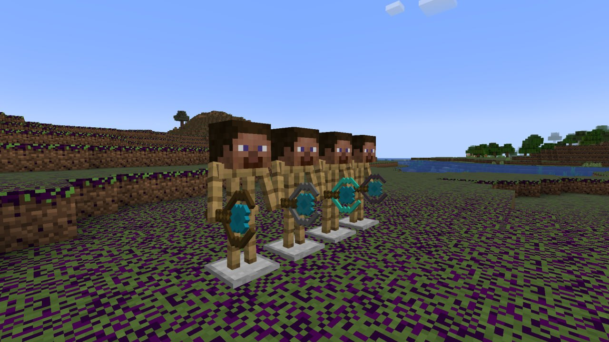

[Українська версія](#void-is-coming-українська)


# How to Download

- **First, click Edit in the right corner, then click Mods.**

  

- **Then click Download Mods, select CurseForge, and search for Void Is Coming. At the bottom, click Select mod for download, then Review and confirm. Click Launch.**

  

# Void Is Coming

A Fabric mod for Minecraft focused on RPG progression, skill-based weapon damage scaling, mana management, and magic wands. Built as part of the "VoidIsComing" modding project.

## Features


- **Mod Entities**: New mobs and a boss.



- **Skill Progression System**: Unlocks weapon damage bonuses for swords, bows, and wands.



- **Magic Wands**: Tiered magic wands (Wooden, Iron, Diamond, Netherite) that shoot custom projectiles.



- **Custom Player Attributes**: Dynamic scaling for health, armor, movement speed, and mana.
- **Consumables**: Custom health and mana potions.
- **In-Game Guide**: After creating a world, you will receive a guidebook (`mod_book`) for tracking your progression.

## Technical & Architecture Highlights

- **Dynamic Attribute Modifiers**: Swords and bows scale attack damage via `PlayerStatApplier` using `EntityAttributeModifier`.
- **Custom Projectile Scaling**: Wand damage is calculated dynamically in `WandItem.java` based on tier values and unlocked skills.
- **Tick-Based Stat Sync**: Player stats and modifiers are re-evaluated using `ServerTickEvents`.
- **Cardinal Components API**: Player mana and skill data are managed via `ModComponents`.
- **Node-Based Skill Tree**: The skill tree uses a node-based structure.

## Requirements

- Minecraft `1.20.1`
- Fabric Loader `>=0.14.0`
- Java 17+
- Fabric API
- Cardinal Components API

## Getting Started

### How to start playing

1. You will need Minecraft 1.20.1 with the Fabric mod loader installed.
2. You will also need Fabric API and Cardinal Components API.
3. Download our mod from GitHub, Modrinth, or PlanetMC.
4. Simply move the mod file into `.minecraft/mods`.
5. Launch Minecraft and check that the mod works properly.

### Installation (for developers)

Clone the repository and run the client:

```bash
git clone https://github.com/mykytenko-petro/VoidIsComing.git
cd VoidIsComing
./gradlew build
./gradlew runClient
```

On Windows, use `gradlew.bat` instead of `./gradlew`.

---

### Conclusion

In this project, we learned how to work with:

* The Java programming language and OOP principles
* 2D and 3D design
* Teamwork using Git and GitHub

**Our biggest challenges were:**

* Creating skills and spells
* Developing animations
* World generation (biomes)

Our mod can serve as a useful example for developing Minecraft (Fabric) modifications.

### Team

- [Petro Mykytenko](https://github.com/mykytenko-petro): team lead, developer, 2D artist
- [Vadim Kuchnii](https://github.com/vxdlmchk-code): member, developer, 2D artist
- [Andrew Skulskyi](https://github.com/andrewskulskuia): member, developer, 2D artist, 3D artist
- [Mykola Boyarkin](https://github.com/KolyaBojarkin): member, developer, 2D artist

---

# Void Is Coming (Українська)

# Як завантажити

- **Спочатку натисніть Edit у правому куті, а потім натисніть Mods.**

  

- **Потім натисніть Download Mods, виберіть CurseForge та введіть Void Is Coming. Внизу натисніть Select mod for download, потім Review and confirm. Натисніть Launch.**

  

# Void Is Coming

Мод для Minecraft на Fabric, зосереджений на RPG-прогресії, масштабуванні шкоди зброї залежно від навичок, управлінні маною та магічних паличках. Мод створений у межах моддингового проєкту "VoidIsComing".

## Можливості


- **Сутності моду**: нові моби та бос.


- **Система розвитку навичок**: відкриває бонуси до шкоди для мечів, луків та чарівних паличок.


- **Магічні палички**: чарівні палички різних рівнів (дерев'яна, залізна, діамантова, незеритова), які стріляють власними снарядами.


- **Власні характеристики гравця**: динамічне масштабування здоров'я, броні, швидкості пересування та мани.
- **Витратні предмети**: власні зілля здоров'я та мани.
- **Ігровий посібник**: після створення світу ви отримаєте книгу-посібник (`mod_book`) для відстеження прогресу.

## Технічні особливості та архітектура

- **Динамічні модифікатори характеристик**: мечі та луки масштабують шкоду від атаки через `PlayerStatApplier`, використовуючи `EntityAttributeModifier`.
- **Динамічне масштабування снарядів**: шкода від паличок динамічно розраховується у `WandItem.java` залежно від рівня палички та відкритих навичок.
- **Синхронізація характеристик на основі тиків**: характеристики гравця та модифікатори повторно перевіряються за допомогою `ServerTickEvents`.
- **Cardinal Components API**: мана та дані про навички гравця керуються через `ModComponents`.
- **Деревоподібна система навичок**: дерево навичок із вузловою структурою.

## Вимоги

- Minecraft `1.20.1`
- Fabric Loader `>=0.14.0`
- Java 17+
- Fabric API
- Cardinal Components API

## Початок роботи

### Як почати грати?

1. Вам знадобиться Minecraft 1.20.1 із встановленим Fabric mod loader.
2. Також вам знадобляться Fabric API та Cardinal Components API.
3. Завантажте наш мод з GitHub, Modrinth або PlanetMC.
4. Просто перемістіть його до `.minecraft/mods`.
5. Запустіть Minecraft і перевірте, чи мод працює належним чином.

### Встановлення (для розробників)

Клонуйте репозиторій та запустіть клієнт:

```bash
git clone https://github.com/mykytenko-petro/VoidIsComing.git
cd VoidIsComing
./gradlew build
./gradlew runClient
```

У Windows використовуйте `gradlew.bat` замість `./gradlew`.

---

### Висновок

У цьому проєкті ми навчилися працювати з:

* Мовою програмування Java та принципами ООП
* 2D- та 3D-дизайном
* Командною роботою з використанням Git та GitHub

**Нашими найбільшими труднощами були:**

* Створення навичок та заклинань
* Розробка анімацій
* Генерація світу (біомів)

Наш мод може бути корисним прикладом для розробки модифікацій для Minecraft (Fabric).

### Команда

- [Петро Микитенко](https://github.com/mykytenko-petro): керівник команди, розробник, 2D-артист
- [Вадим Кучмій](https://github.com/vxdlmchk-code): учасник, розробник, 2D-артист
- [Андрій Скульський](https://github.com/andrewskulskuia): учасник, розробник, 2D-артист, 3D-артист
- [Микола Бояркін](https://github.com/KolyaBojarkin): учасник, розробник, 2D-артист