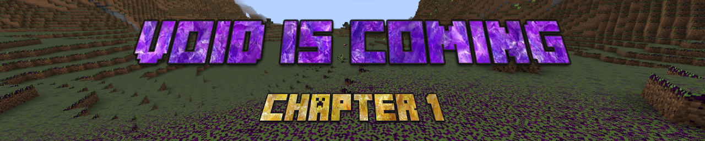

# Void Is Coming

A Fabric mod for Minecraft focused on RPG progression, skill-based weapon damage scaling, mana management, and magic wands. Built as part of the "VoidIsComing" modding framework.

## Features

- **Skill Progression System**: Unlocks weapon damage bonuses for swords, bows, and wands.
- **Magic Wands**: Tiered magic wands (Wooden, Iron, Diamond, Netherite) shooting custom.
- **Custom Player Attributes**: Dynamic scaling for health, armor, movement speed, and mana.
- **Consumables**: Custom health and mana potions.
- **In-Game Guide**: After creating the world you will get guidebook (`mod_book`) for progression tracking.

## Technical & Architecture Highlights

- **Dynamic Attribute Modifiers**: Swords and Bows scale attack damage via `PlayerStatApplier` using `EntityAttributeModifier`.
- **Custom Projectile Scaling**: Wand damage is calculated dynamically in `WandItem.java` based on tier values and unlocked skills.
- **Tick-Based Stat Sync**: Player stats and modifiers are re-evaluated using `ServerTickEvents`.
- **Cardinal Components API**: Player mana and skill data are managed via `ModComponents`.
- **Node Based SkillTree**: SkillTree with Noded Structure

## Requirements

- Minecraft `1.20.1`
- Fabric Loader `>=0.14.x`
- Java version 21+
- Fabric API
- Cardinal Components API

## Getting Started

### Installation

1. Download the latest `.jar` release.
2. Place the file into your `.minecraft/mods` directory alongside **Fabric API** and **Cardinal Components API**.
3. Launch Minecraft with the Fabric profile.

---

